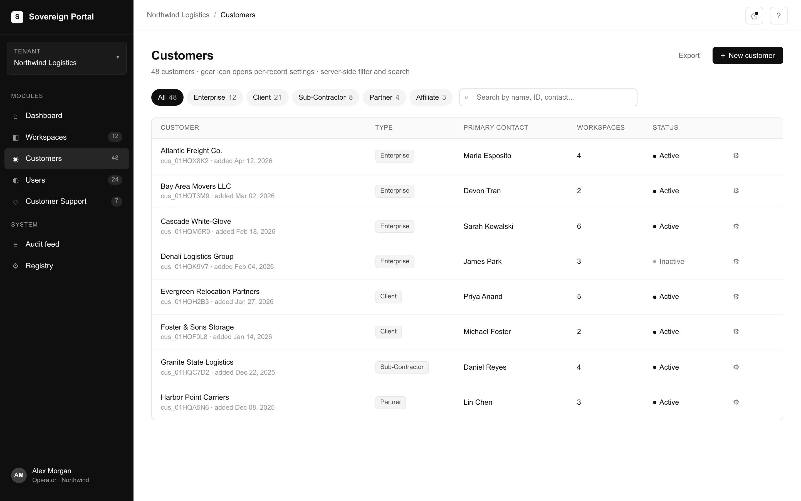
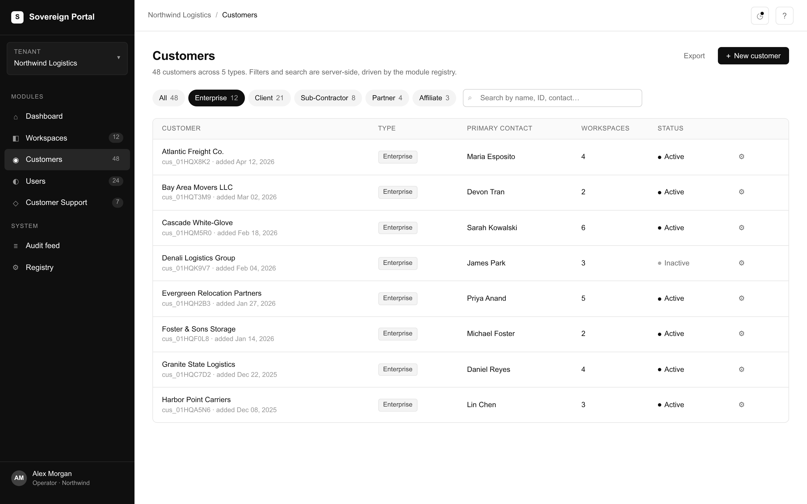
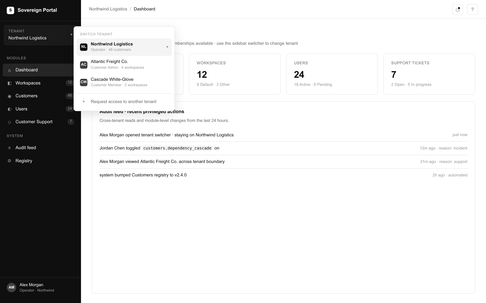
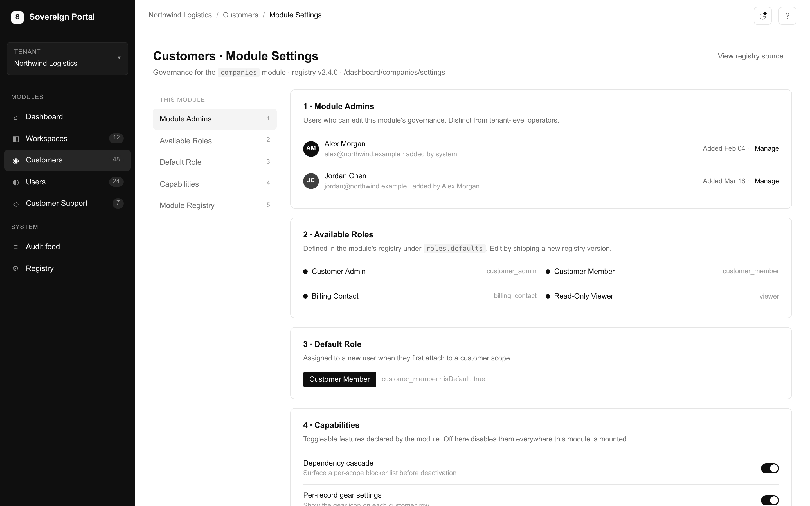
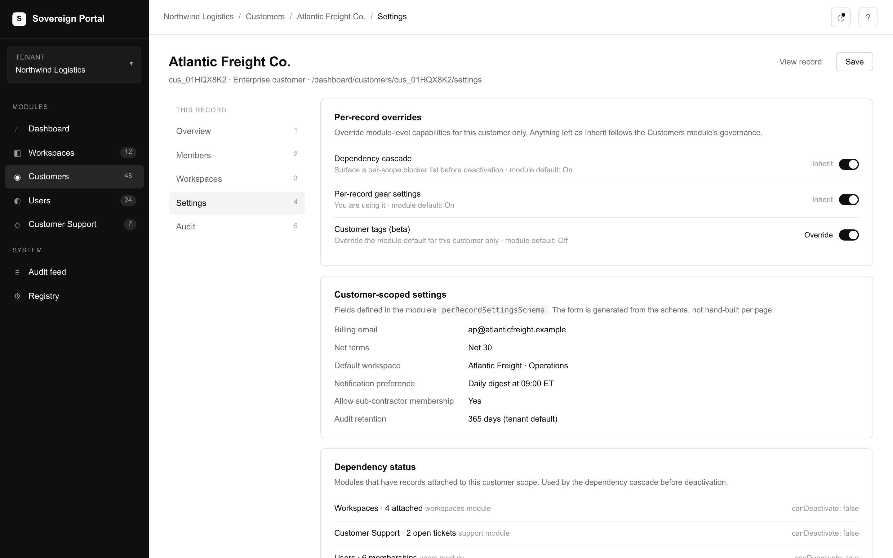
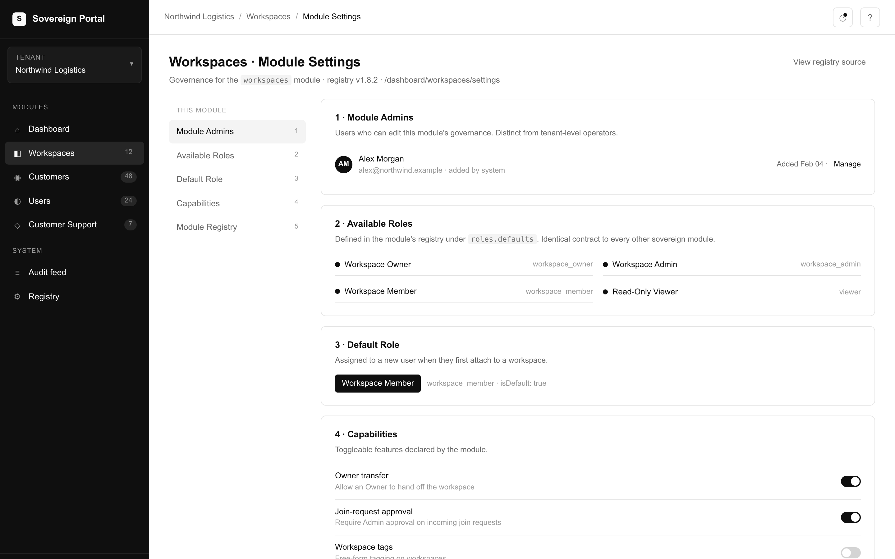
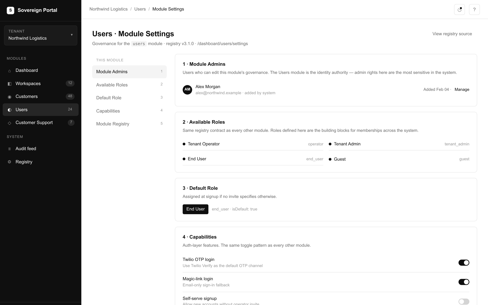
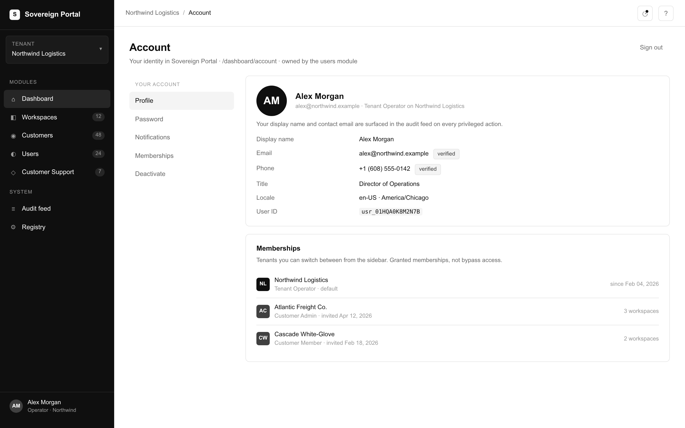

# Sovereign Portal

[](./LICENSE)
[](https://github.com/freshifyv2/freshify-sovereign-portal/releases)
[](https://nodejs.org/)
[](#what-the-foundation-gives-you)
[](#production-deployment)

**A working sovereign foundation for owned business software — Users, Customers, Workspaces, and a Standard Module Interface for everything you build on top.**

Sovereign Portal is the open-source foundation underneath modern modular business software. You get three working sovereign modules (Users, Customers, Workspaces), a portal shell that hosts them, and a Standard Module Interface (SMI) every module conforms to. Self-host on your own cloud. No SaaS tenant. No license keys. No tiered access.

It runs locally in three commands.

```bash
git clone https://github.com/freshifyv2/freshify-sovereign-portal.git
cd freshify-sovereign-portal
./scripts/clone-all.sh           # clones the seven component repos as siblings
cp .env.example .env
docker compose up --build
```

Then open <http://localhost:3000>. The `seed` service runs once on first boot, provisions the operator account, and prints the credentials in the compose logs:

- email: `operator@sovereign.local`
- password: `sovereign-portal-admin`

A phone+OTP login path is also wired (phone `+15555550199`, OTP bypass code `424242`). All defaults are overridable in `.env`.

---

## What you see when it's running

> Screenshots below are rendered from the canonical Sovereign Portal design system. The local `docker compose` stack ships the same UI.

### Customers list — typed, gear-per-record, dependency-aware

The Customers module (canonical key `companies`, default UI label "Customers") ships with five customer types out of the box (Enterprise, Client, Sub-Contractor, Partner, Affiliate). Every record gets a gear icon — the standard entry point into per-record settings.



### Registry-driven filter chips

Filter chips are driven by the module's registry, not hardcoded UI strings. The list, search, and counts all run server-side as pure server components.



### Multi-tenant operator switching

Operators with cross-tenant memberships switch tenants from the account pulldown. There is no privileged "see everything" bypass — operators see what their memberships grant them, audit-logged on every cross-tenant read.



### Module Settings — the registry + governance pattern

Every module ships the same five-section Settings page: Module Admins, Available Roles, Default Role, Capabilities, and a read-only view of the module's Registry. The page below is the Customers module's Settings.



### Per-record settings — same pattern, different scope

The gear icon on any record opens a per-record settings page at `/dashboard/{module}/{id}/settings`. Governance lives in module-level settings; per-record overrides live here.



### Same pattern across every module — Workspaces

The Workspaces Module Settings page. Identical structure to the Customers page above — same five sections, same registry view, same governance contract. Every sovereign module looks structurally identical.



### Same pattern across every module — Users

The Users Module Settings page. Identical structure again. The Standard Module Interface is what makes this consistency possible — not a UI framework, but a contract every module conforms to.



### Account page — identity owned by the Users module

The Users module owns identity end-to-end: account page, password change, notification preferences, deactivation, and the membership/tenant model that powers the switcher.



---

## What's in the box

**Foundation modules** (the working sovereign foundation):

- **Users** — signup, login, password reset, invite acceptance, sessions, role catalogs, memberships. Pluggable auth adapter; Twilio OTP reference implementation ships as default.
- **Customers** — multi-type companies with three-tier attachment scope (`company` / `workspace` / `location`) and dependency-aware deactivation.
- **Workspaces** — name-only workspaces with Owner transfer, join-request approval flow, and per-Workspace module installations.

**Portal shell** — the navigation chrome, the tenant switcher, the cross-module routing layer, the audit feed surface, the legacy-redirect handler.

**Standard Module Interface (SMI)** — the contract every sovereign module conforms to. Module registry, peer registry, per-record liveness, dependency cascade, auth adapter, role catalog, agent sidecars. Full spec in [`docs/smi-spec.md`](./docs/smi-spec.md).

---

## Build it yourself, or hire help

Sovereign Portal is genuinely complete as a foundation. Everything you need to build a sovereign module is in this repo: the SMI spec, three working modules to learn from, a permission model, an anti-patterns guide.

Three categories of acceleration assets are **not** in the public repo — they are part of [Freshify](https://freshify.io)'s commercial offering:

- **Production module library** — battle-tested BE+FE pairs for common business domains (Orders, Inventory, Billing, Locations, Support, CRM). Each one is hours-to-days of work saved vs. building against the SMI from scratch.
- **Agent training packs** — system prompts, evaluation harnesses, golden datasets, and RAG indexing recipes for sovereign-module AI agents. The SMI describes `/agent/*` routes; making them actually useful is non-trivial ML work.
- **Production deployment + managed operations** — Terraform/Pulumi recipes, Cloud Run / EKS / Fargate runbooks, secrets layout, migration plans from legacy SaaS, on-call coverage.

The public foundation is fully self-sufficient — you can DIY all of it. The paid offering compresses the timeline from months to weeks. See [SUPPORT.md](./SUPPORT.md) or contact [Freshify](https://freshify.io) for engagement details.

---

## What's not in the box

- **No hosted SaaS tenant.** You self-host on your own cloud. Always.
- **No license keys, no tiered access.** Everything in the public repo is everything you get.
- **No no-code visual builder.** Your team writes JavaScript modules against the Standard Module Interface. If they can't, this is not the product for you — talk to [Freshify](https://freshify.io) about a custom engagement instead.
- **No business modules.** Orders, Pricing, Locations, Billing — none of them ship in this repo. They are what you build on top, against the Standard Module Interface.
- **No marketplace.** Each module is a sovereign repo you control.

---

## The repos

Sovereign Portal is a meta-repo that orchestrates the actual code, which lives in eight sibling repos under the [`freshifyv2`](https://github.com/freshifyv2) GitHub org. `docker compose` builds each service directly from its sibling clone:

| Repo | What it is | Port (local) |
|---|---|---|
| [`freshify-sovereign-portal`](https://github.com/freshifyv2/freshify-sovereign-portal) (this repo) | Meta-repo, compose file, top-level docs | — |
| [`freshify-portal-shell`](https://github.com/freshifyv2/freshify-portal-shell) | Portal shell host (navigation, tenant switcher, routing, audit feed) | 3000 |
| [`freshify-portal-shell-ui`](https://github.com/freshifyv2/freshify-portal-shell-ui) | Shared design-system package (theme, primitives, layout shell) | — |
| [`freshify-users`](https://github.com/freshifyv2/freshify-users) | Users module backend (auth, sessions, profiles) | 4001 |
| [`freshify-users-fe`](https://github.com/freshifyv2/freshify-users-fe) | Users module frontend (list, detail, settings, invites) | 3001 |
| [`freshify-companies`](https://github.com/freshifyv2/freshify-companies) | Customers module backend (companies, roles, scoped permissions) | 4002 |
| [`freshify-companies-fe`](https://github.com/freshifyv2/freshify-companies-fe) | Customers module frontend (list, detail, registry, settings) | 3002 |
| [`freshify-workspaces`](https://github.com/freshifyv2/freshify-workspaces) | Workspaces module backend (workspaces, scoped roles, membership) | 4003 |
| [`freshify-workspaces-fe`](https://github.com/freshifyv2/freshify-workspaces-fe) | Workspaces module frontend (list, detail, role management) | 3003 |

The portal shell, the shell-ui package, and the meta-repo are framework infrastructure. The other six repos are the three sovereign foundation modules (Users, Customers, Workspaces) — backend and frontend each. Every component repo is tagged at the same release (`v0.1.0` as of June 2026) and links back to this meta-repo as its homepage.

`scripts/clone-all.sh` clones the seven component repos into the same parent directory as this one. The compose file expects that layout.

---

## Documentation

| Doc | What it covers |
|---|---|
| [`docs/quickstart.md`](./docs/quickstart.md) | Walkthrough for adding a new sovereign module against the SMI. Start here once the local stack is running. |
| [`docs/smi-spec.md`](./docs/smi-spec.md) | The Standard Module Interface — registry, peer registry, record-status, dependency-status, auth adapter, agent sidecars. The contract every module conforms to. |
| [`docs/permission-model.md`](./docs/permission-model.md) | The four-tier scope (User → Customer → Workspace → Module) and three-layer permission check. The conceptual model. |
| [`docs/module-registry-and-settings.md`](./docs/module-registry-and-settings.md) | The Module Registry shape every module exports, and the Module Settings page every module surfaces. |
| [`docs/anti-patterns.md`](./docs/anti-patterns.md) | 20 mistakes the framework is built to prevent, with the right fix for each. Grep this when something feels wrong. |
| [`docs/code-stripping-checklist.md`](./docs/code-stripping-checklist.md) | Internal checklist used to prepare the foundation repos for public release. Useful if you want to understand the boundary between framework and deployment-specific code. |

---

## Quickstart for builders

Once the local stack is running, the next step is building your own sovereign module. The full walkthrough lives in [`docs/quickstart.md`](./docs/quickstart.md). Summary:

1. **Boot the foundation.** `./scripts/clone-all.sh && docker compose up --build`. Verify the dashboard renders at <http://localhost:3000>.
2. **Stand up the BE.** Create a new repo with the SMI surface documented in [`docs/smi-spec.md`](./docs/smi-spec.md): `/smi/registry`, `/smi/records`, `/smi/health`, and your domain routes (`/v1/<your-module>`).
3. **Fill in the registry.** Export the canonical fields (key, label, attachmentScopes, dependencies, smiPath, ownedCollections, events, capabilities, settingsSchema, perRecordSettingsSchema, roles).
4. **Stand up the FE.** Use the portal-shell's chrome contract — the shared design system + layout primitives live in [`freshify-portal-shell-ui`](https://github.com/freshifyv2/freshify-portal-shell-ui).
5. **Register it with the portal shell.** Add a peer URL entry pointing at your new BE and FE.

You will write zero auth code, zero tenant-scoping logic, and zero settings-page boilerplate that the foundation modules don't already handle. If you want to skip steps 2–4 entirely — with a production-tested module starter, the matching agent training pack, and a deployment plan — those are part of [Freshify](https://freshify.io)'s commercial offering. The DIY path is fully supported by this repo.

---

## Production deployment

The compose file is for local development. For production, each module is a standard Node.js service that runs anywhere — Kubernetes, Cloud Run, Fargate, an EC2 box. The contracts in the SMI spec are network-protocol-level (HTTP + JSON), so a real deployment looks like:

- Each BE deployed independently with its own MongoDB connection
- Each FE built once and served behind the portal shell
- Portal shell deployed once, configured with the peer module URLs
- A secret manager holding `JWT_SECRET`, `INTERNAL_S2S_SECRET`, `EVENT_INBOUND_SECRET`, and any third-party credentials (Twilio, etc.)
- A managed MongoDB cluster (Atlas, DocumentDB, self-hosted)

We do not ship Terraform, Helm charts, or Kubernetes manifests in the public repo because they would presuppose a specific cloud and would lock you into Freshify's opinions about your deployment. If you want Freshify to deploy and operate Sovereign Portal for you, see [SUPPORT.md](./SUPPORT.md) — production deployment is a paid engagement.

---

## Contributing

We accept issues, PRs, and module contributions. See [CONTRIBUTING.md](./CONTRIBUTING.md) for the contribution process, [CODE_OF_CONDUCT.md](./CODE_OF_CONDUCT.md) for community standards, and [SECURITY.md](./SECURITY.md) for vulnerability disclosure.

The single highest-leverage contribution is a new sovereign module published against the SMI. If you ship one, open an issue tagged `module-showcase` — we will link it from the README.

---

## License

Apache 2.0. See [LICENSE](./LICENSE) and [NOTICE](./NOTICE).

This is genuine open source — no Business Source License, no Functional Source License, no "open core with paid features," no license keys gating functionality. Everything in this repo is everything you get.

---

## Support

Community support is via GitHub Issues. For paid production support — deployment, operations, custom module builds, architecture consulting — see [SUPPORT.md](./SUPPORT.md).

Sovereign Portal is maintained by [Freshify, Inc.](https://freshify.io), a design and architecture consultancy specializing in modular service architecture for mid-market companies.
